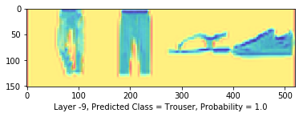
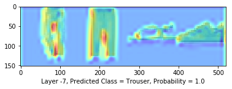
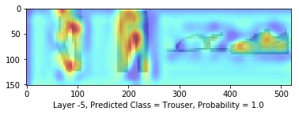

# Multi-Label Classification and Class Activation Map on Fashion-MNIST

This is an updated version of below repo.
1. changed the python file to jupyter notebook format.
2. explored the layers activation

-----

This repository covers the code for the blog.

- https://towardsdatascience.com/multi-label-classification-and-class-activation-map-on-fashion-mnist-1454f09f5925

**Code**:
There are two files in this task: *fashion_plot.py* and *fashion_read.py*
- *fashion_plot.py* ~ create the new datasets and their metadata files
  (usage: 1. create two folders "train" and "test", 2. run python fashion_plot.py under the "train" folder which will create all the image files and the metadata file called "labels.csv", 3. run python fashion_ploy.py under the "test" folder which will create all the image files and the metadata file called "labels.csv";)
- *fashion_read.py* ~ implement multi-label classification and class activation map, i.e., read "train/labels.csv" to train and read "test/labels.csv" to test
  (usage: python fashion_read.py)

**Dependency**:
- Python 2.7.11
- Keras 2.1.6
- Theano 0.9.0 
- Pandas 0.18.1
- Numpy 1.14.3
- Matplotlib 1.5.1
- Opencv-python 3.3.0.10

**Metadata**:
- *labels.csv* is presented for reference only. It is better to run *fashion_plot.py* and create your own dataset and metadata.

**Note**:
- My Win10 12G RAM notebook (with no GPU) has two software environments: Python 2.7.11/Keras 2.1.6/Theano 0.9.0 and Python 3.6.3/Keras 2.0.8/Tensorflow 1.4.0. The programs (with some ugly compromises) running under the former one mainly due to the memory issue. Further, it takes about 1 or 2 days to complete training on my notebook. 
- Using a global average polling layer to implement class activation maps might not be the best solution in this case. Probably, Grad-CAM might achieve better results.
